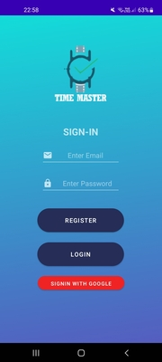

# TimeMaster
 Automatic Time-Tracking with GCB Auth & Realtime Database.
 
 Developed with Kotlin, Firebase - Authentication & Real-Time Database.
 
 Features Include:
 - Manual & Automatic time entry options,
 - Entry categorisation,
 - Goal setting,
 - Pay & tax rate calculation,
 - Visualisation graph.
 

  
   

